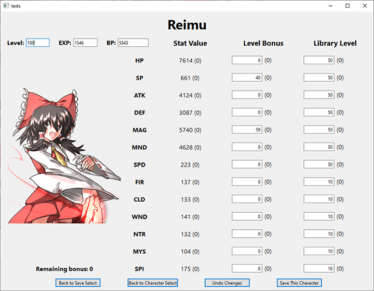

# Touhou Labyrinth 1 Character Save Editor

This repository provides a save editor for Touhou Labyrinth 1 capable of editing a character's stats. Unlike editing a raw hex file, which would require computing the correct multipliers for each combination of level and library bonuses, this software provides an intuitive interface that abstracts the multipliers for you and lets you freely edit the level and library bonuses:

Editing any of the bonuses or level information will provide immediate feedback on how the character's stats will change with the new values provided:

*Please keep in mind that all changes are made directly to your save file, so keep backups!*

Additionally, the developer's PNGs seem to have some issue with them, since the libpng module screams out an error whenever they're loaded. The software seems to work fine though, lol.

## Build Instructions

The application was developed in Python, using Qt for the GUI. You can either download these tools for your PC or download the 7zip file provided in the Releases tab. The zip file is 100MB after extracted, since it is just a packed installation of these tools, and is only provided for convenience. Installing and running Python in Windows is easy:

* Head over to https://www.python.org/downloads/ and download Python 3.9 (or any 3.x release)
* Make sure you install the "pip" module when installing Python
* Make sure you also click the option to add Python to your system's PATH
* Optionally, install the "py launcher" module to easily run python scripts
* Open a CMD and type in "pip install pyside6"
  * You can open a CMD by pressing the windows key then typing "cmd"
* Download this repository's source code through Github
* If you installed the py launcher, simply double click "main.py"
  * You can also open a CMD and type "python main.py" from the directory you downloaded to

If you're running Linux, please refer to your distribution's Python and Qt installation instructions. Chances are you already have Python and pip installed by default!
